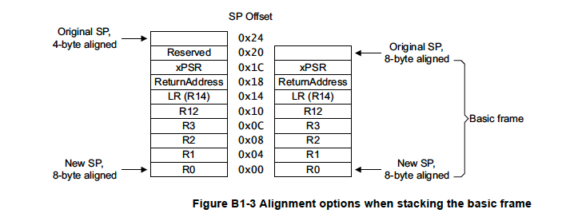

# 🕒 Bare-Metal Task Scheduler using SysTick and PendSV (STM32F401RE)

A minimal cooperative task scheduler implemented in **bare-metal C** for the **STM32F401RE** microcontroller. This project uses the **SysTick** timer to trigger periodic interrupts and the **PendSV** exception for low-priority context switching — mimicking the behavior of a simple RTOS without any OS.

---

## 🚀 Features

- 🧠 Custom context switching using PendSV
- ⏱️ SysTick interrupt for periodic scheduling
- 🧵 Cooperative multitasking (round-robin)
- 🗂️ Multiple tasks with independent stacks
- 🖨️ Bare-metal `printf` via SWV (Serial Wire Viewer)
- ⏱️ Cycle-accurate profiling using ARM DWT

---

## ⚙️ How It Works

### 1. SysTick + PendSV = Context Switch

- `SysTick_Handler` triggers every 1ms.
- It sets the PendSV pending bit.
- `PendSV_Handler` performs the actual context switch.

### 2. Stack Frame (ARM Cortex-M4)

When switching context, registers are saved/restored using a well-defined stack structure.

#### Stack Frame Diagram



| Register | Description        | Auto/Manual |
|----------|--------------------|-------------|
| xPSR     | Program Status Reg | Auto        |
| PC       | Return Address     | Auto        |
| LR       | Link Register      | Auto        |
| R0–R3    | Argument registers | Auto        |
| R12      | Scratch reg        | Auto        |
| R4–R11   | Callee-saved regs  | **Manual**  |

---

## 💡 Project Structure

.
├── Core/
│ ├── Inc/
│ │ └── scheduler.h
│ ├── Src/
│ │ ├── main.c
│ │ └── scheduler.c
├── images/
│ └── stack_frame.png
├── .project
├── README.md


---

## 🛠️ Setup Instructions

### Prerequisites

- STM32F401RE Nucleo Board
- STM32CubeIDE (No `.ioc`, manually created bare-metal project)
- ST-Link Debugger (SWD)
- SWV enabled in debug config

### Build & Flash

1. Clone the repository:
   ```bash
   git clone https://github.com/your-username/baremetal-systick-pendsv-scheduler.git

    Open the folder in STM32CubeIDE

    Build the project (Ctrl+B)

    Connect the board and click Debug

    Enable SWV ITM Console, add Stimulus Port 0

🧪 SWV Output (Optional)

This project uses printf() redirected to ITM for real-time debug:

printf("Task 1 running\n");

To view the output:

    Open SWV ITM Console in STM32CubeIDE

    Enable Port 0

    Set core clock = 84 MHz

    Start trace session to view task logs

📚 References

    STM32F401RE Reference Manual

    ARM Cortex-M4 TechRef

    CMSIS-Core

    STM32 SWV Guide

🙋 Why Use This?

✅ Learn:

    Cortex-M exception handling

    Cooperative multitasking

    Real-time debugging via SWV

    Stack frames and manual context switching

📜 License

This project is licensed under the MIT License
